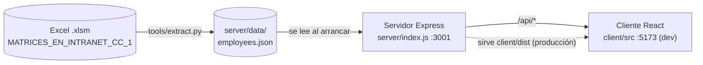

# Matriz de Habilidades — Documentación técnica

Aplicación web interna para **buscar colaboradores por nombre o número de nómina** y consultar su **perfil de competencias** (por línea/estación, con nivel) y los **cursos tomados**. Los datos provienen de un Excel de matrices de habilidades que se convierte a JSON con un script de Python.

| | |
|---|---|
| **Frontend** | React 18 + Vite 6 |
| **Backend** | Node.js (≥ 20.19.0) + Express 4 |
| **Datos** | Archivo JSON estático (`server/data/employees.json`), cargado en memoria al arrancar |
| **ETL** | `tools/extract.py` (Python + openpyxl) |
| **Idioma de la UI** | Español |

---

## 1. Arquitectura



Puntos clave:

- **No hay base de datos.** Todo el dataset se carga en memoria al iniciar el servidor; cualquier cambio en el JSON requiere **reiniciar** el servidor.
- **Modo desarrollo:** dos procesos (API en `:3001`, Vite en `:5173`). Vite hace proxy de `/api` hacia `:3001`.
- **Modo producción:** un solo proceso. Express sirve la API y el frontend compilado (`client/dist`), con fallback a `index.html` para cualquier ruta no-API.

---

## 2. Estructura del repositorio

```
matriz-app-main/
├── package.json            # Scripts raíz (install:all, dev, build, start)
├── README.md               # Guía rápida
├── .gitignore              # node_modules, client/dist
├── client/                 # Frontend (React + Vite)
│   ├── index.html
│   ├── vite.config.js      # Puerto 5173 + proxy /api → :3001
│   ├── package.json
│   ├── public/ZF_logo.svg
│   └── src/
│       ├── main.jsx        # Punto de entrada
│       ├── App.jsx         # Buscador + lista de resultados
│       ├── Profile.jsx     # Panel modal con el perfil
│       └── styles.css      # Estilos (tema azul marino, tarjetas "glass")
├── server/                 # Backend (Express)
│   ├── index.js            # API + servidor de estáticos
│   ├── package.json
│   └── data/employees.json # Dataset generado (≈ 620 KB)
└── tools/
    └── extract.py          # Excel → employees.json
```

---

## 3. Requisitos y puesta en marcha

**Requisitos:** Node.js ≥ 20.19.0 y npm. Python 3 + `openpyxl` solo si se va a regenerar el dataset.

```bash
npm run install:all   # instala dependencias de raíz, server y client
npm run dev           # API en :3001 y frontend en http://localhost:5173
```

**Producción** (un solo proceso):

```bash
npm start             # compila el cliente (vite build) y arranca el servidor en :3001
```

### Scripts de `package.json` (raíz)

| Script | Qué hace |
|---|---|
| `install:all` | `npm install` en raíz, `server/` y `client/` |
| `dev` | Levanta servidor (`node --watch`) y Vite en paralelo con `concurrently` |
| `build` | `vite build` en `client/` → genera `client/dist` |
| `start` | `build` + `node index.js` en `server/` |

### Variables de entorno

| Variable | Default | Uso |
|---|---|---|
| `PORT` | `3001` | Puerto del servidor Express |

> Si se cambia `PORT` en desarrollo, hay que actualizar también el proxy en `client/vite.config.js`.

---

## 4. Modelo de datos

### 4.1 Formato del archivo `employees.json` (crudo)

Objeto indexado por **nómina** (string). Las claves están abreviadas para reducir tamaño:

```jsonc
{
  "12345": {
    "n": "Nombre del colaborador",          // nombre
    "m": {                                  // matrices: una entrada por hoja del Excel
      "CDC EVO1": {                         // nombre de la hoja = línea/estación
        "turno": "1",                       // puede ser null
        "linea": "…",                       // valor de la columna "Línea" (puede ser null)
        "puesto": "…",                      // puede ser null
        "skills": { "Competencia A": 3, "Competencia B": 2 }   // nombre → nivel
      }
    },
    "c": [                                  // cursos
      { "curso": "Nombre del curso", "fecha": "2024-05-17" }   // fecha puede ser null
    ]
  }
}
```

### 4.2 Modelo en memoria (lo que devuelve la API)

Al arrancar, `server/index.js` transforma el JSON crudo a un modelo legible:

```jsonc
{
  "id": "12345",
  "nombre": "Nombre del colaborador",
  "matrices": [
    {
      "linea": "CDC EVO1",                  // = nombre de la hoja (ordenado alfabéticamente)
      "puesto": "…",
      "turno": "1",
      "competencias": [ { "nombre": "Competencia A", "nivel": 3 } ]
    }
  ],
  "cursos": [ { "curso": "…", "fecha": "2024-05-17" } ]
}
```

### 4.3 Dataset incluido (snapshot del zip)

| Métrica | Valor |
|---|---|
| Colaboradores | 1 198 |
| Líneas/estaciones distintas | 77 |
| Colaboradores con cursos | 72 |
| Colaboradores sin ninguna matriz | 222 |

---

## 5. API REST

Base: `http://localhost:3001`. Todas las respuestas son JSON. No hay autenticación.

### `GET /api/stats`

Totales generales.

```json
{ "colaboradores": 1198, "lineas": 77 }
```

- `colaboradores`: total de registros en el JSON (incluye quienes no tienen matrices).
- `lineas`: número de líneas/estaciones distintas entre todas las matrices.

### `GET /api/employees?q=texto&limit=60`

Búsqueda por **nombre o nómina**.

| Parámetro | Obligatorio | Descripción |
|---|---|---|
| `q` | Sí | Texto a buscar. Si está vacío o ausente → `[]` |
| `limit` | No | Máximo de resultados. Default `60`, tope `200` |

Comportamiento de la búsqueda:

- Es **insensible a mayúsculas y a acentos** (normalización NFD; `"José"` coincide con `"jose"`).
- Es una coincidencia por **subcadena contigua** sobre el texto `"<nómina> <nombre>"`. Por ejemplo, buscar `"perez juan"` no encuentra `"JUAN PEREZ"`, porque las palabras deben aparecer en ese orden y seguidas.
- Resultados ordenados alfabéticamente por nombre.

Respuesta (resumen por colaborador):

```json
[
  { "id": "12345", "nombre": "Nombre", "lineas": 3, "competencias": 14, "cursos": 1 }
]
```

### `GET /api/employees/:id`

Perfil completo del colaborador (modelo de la sección 4.2).

- `200` → objeto del perfil.
- `404` → `{ "error": "Colaborador no encontrado" }`.

### Frontend estático

Si existe `client/dist`, Express lo sirve con `express.static` y devuelve `index.html` para cualquier ruta que no coincida con la API. Si no existe (modo desarrollo), solo responde la API.

---

## 6. Servidor (`server/index.js`)

Flujo:

1. **Normalización** – `norm(s)`: convierte a minúsculas y elimina diacríticos (`normalize('NFD')` + regex `[\u0300-\u036f]`).
2. **Carga de datos** – lee y parsea `data/employees.json` una sola vez y lo transforma al modelo de la sección 4.2.
3. **Índices**
   - `byId`: `Map` nómina → colaborador (consulta O(1) del perfil).
   - `searchIndex`: arreglo de `{ e, key }`, donde `key = norm(id) + " " + norm(nombre)`. La búsqueda es un `filter` lineal con `includes`; para ~1 200 registros es instantánea.
4. **`summary(e)`** – calcula `lineas`, `competencias` (suma de competencias en todas las matrices) y `cursos`.
5. **Rutas** – las tres rutas de la sección 5 + estáticos de producción.
6. **`app.listen(PORT)`**.

---

## 7. Cliente (`client/src`)

### `main.jsx`
Monta `<App />` en `#root` e importa `styles.css`.

### `App.jsx` — pantalla principal

Estado local (`useState`):

| Estado | Contenido |
|---|---|
| `q` | Texto del buscador |
| `results` | Resumen de colaboradores encontrados |
| `stats` | Totales de `/api/stats` (se muestran en el encabezado) |
| `selected` | Perfil abierto (o `null`) |
| `error` | Mensaje de error visible |

Comportamiento:

- Al montar, consulta `/api/stats`. Si falla → *"No se pudo conectar con el servidor."*
- **Búsqueda con debounce de 200 ms**: cada cambio de `q` programa una petición y cancela la anterior (`clearTimeout` en el cleanup del `useEffect`). Con `q` vacío limpia los resultados.
- Al hacer clic en un resultado, `open(id)` carga `/api/employees/:id` y lo guarda en `selected`, lo que muestra `<Profile>`.
- Mensajes de ayuda: estado inicial, "Sin resultados" y errores.
- `api(url)` es un helper de `fetch` que lanza error si `!r.ok` y devuelve JSON.

### `Profile.jsx` — panel de perfil (modal)

Props: `emp` (perfil) y `onClose`.

- Se cierra con **Esc**, con clic en el fondo (`overlay`) o con el botón ✕. El clic dentro del panel no propaga (`stopPropagation`).
- Bloquea el scroll del `body` mientras está abierto y lo restaura al cerrar.
- Sección **"Líneas / estaciones y competencias"**: una tarjeta por línea (nombre, puesto y turno) y una fila por competencia con su nivel.
- Sección **"Cursos tomados"**: nombre del curso y fecha.
- Subcomponente **`Dots`**: dibuja 4 puntos y rellena hasta `nivel` (tooltip `Nivel N`).

### `styles.css`
Tema azul marino con variables CSS en `:root` (`--navy`, `--accent`, `--bg`, …) y tarjetas translúcidas. Clases principales: `wrap`, `header`, `search`, `results`, `result`, `badge`, `overlay`, `panel`, `line-card`, `skill`, `dots`/`dot`, `course`, `hint`.

### `vite.config.js`
Plugin de React, puerto `5173` y proxy `'/api' → http://localhost:3001`.

---

## 8. Actualizar los datos (`tools/extract.py`)

```bash
pip install openpyxl
python tools/extract.py ruta/al/MATRICES_EN_INTRANET_CC_1.xlsm
# reiniciar el servidor después
```

Si no se pasa argumento, busca `MATRICES_EN_INTRANET_CC_1.xlsm` en el directorio actual. El resultado se escribe en `server/data/employees.json`.

### Lógica del script

1. **Abre el libro** con `data_only=True` (valores calculados, no fórmulas) y `keep_vba=True`.
2. **Descarta hojas no relevantes** (`SKIP`): `Menú`, `Documentación`, `Resumen`, `.`, `..`, `AVANCE MENSUAL`, `Hoja47`, `Base graficas`, `2X2 CDCE` y `Soldadura básica`.
3. **Por cada hoja restante**, busca la fila de encabezado: la primera celda con el texto *Nómina/Nomina* dentro de las primeras 20 filas y 10 columnas. Si no la encuentra, la hoja se ignora.
4. **Mapea columnas** por nombre de encabezado (sin distinguir mayúsculas): `Nómina`, `Nombre`, `Turno`, `Puesto` y `Línea` (acepta variantes como "línea en tress", "línea tress").
5. **Las competencias son todas las demás columnas con encabezado**, excepto las que se llaman solo con dígitos.
6. **Recorre las filas** hacia abajo hasta encontrar **5 filas vacías consecutivas**. Omite filas sin nombre o con nómina `#N/A`.
7. **Guarda solo niveles numéricos distintos de cero.** Si un colaborador no tiene ninguna competencia en esa hoja, no se registra la matriz.
8. **Cursos:** lee la hoja `Soldadura básica` (col. A nómina, B nombre, C fecha, D curso) desde la fila 2. Las fechas se guardan como `YYYY-MM-DD`.
9. **Limpieza:** si el nombre no es texto o empieza con `#`, se sustituye por `Empleado #<nómina>`.
10. **Escritura** del JSON compacto en UTF-8.

Si un colaborador aparece en varias hojas, sus matrices se fusionan bajo la misma nómina (una entrada por hoja).

### Si cambia la estructura del Excel

| Cambio | Qué ajustar |
|---|---|
| Nueva hoja que no es matriz | Agregarla a `SKIP` |
| Encabezado de línea con otro nombre | Agregar la variante a `LINEA` |
| Encabezado "Nómina" más allá de fila 20 / columna 10 | Ampliar los rangos en `find_header` |
| Cursos en otra hoja o con otro orden de columnas | Modificar el bloque de `Soldadura básica` |

---

## 9. Despliegue

1. `npm run install:all`
2. `npm start` (compila y sirve todo desde el puerto `3001`; se puede cambiar con `PORT`).
3. Para un servicio persistente en un servidor, ejecutar `node server/index.js` bajo un gestor de procesos (pm2, systemd, servicio de Windows, etc.) después de haber corrido `npm run build`.

---

## 10. Observaciones y puntos a considerar

Detectados al revisar el código; ninguno impide que la app funcione hoy.

1. **Niveles mayores a 4.** La UI dibuja solo 4 puntos, pero el dataset contiene niveles de hasta 52 (≈ 1 300 de ≈ 10 700 registros superan 4). Esos casos se ven como "4 de 4" con tooltip `Nivel N`. Conviene confirmar si esos valores son legítimos (otra escala, horas, conteos) o datos que deben limpiarse en `extract.py`.
2. **Datos personales sin control de acceso.** La API no tiene autenticación y el JSON con nombres y nóminas está en el repositorio. Si se despliega en la intranet, valorar restringir el acceso (red, SSO, proxy inverso) y qué se versiona en Git.
3. **El campo `linea` del JSON no se usa.** El servidor toma como "línea" el **nombre de la hoja** (la clave de `m`), no la columna `Línea` del Excel que `extract.py` guarda.
4. **Búsqueda por subcadena contigua.** Buscar apellido + nombre en orden distinto al almacenado no devuelve resultados (ver sección 5).
5. **`limit` inválido.** Un valor negativo llega a `slice(0, limit)` y recorta resultados desde el final; conviene forzar un mínimo de 1.
6. **Dependencia circular.** `client/package.json` y `server/package.json` declaran `"matriz-habilidades": "file:.."` (el paquete raíz). No se usa en el código y probablemente se puede eliminar.
7. **Cursos limitados a una hoja.** Los cursos salen únicamente de `Soldadura básica`, aunque la UI los presenta como "Cursos tomados" en general.
8. **Sin pruebas automatizadas ni linter.**
9. **Recarga de datos manual.** Al actualizar `employees.json` hay que reiniciar el servidor (podría agregarse un endpoint o vigilancia del archivo).
10. **Colaboradores sin matrices.** 222 de 1 198 aparecen en la búsqueda pero su perfil muestra *"Sin competencias registradas en las matrices"*.
